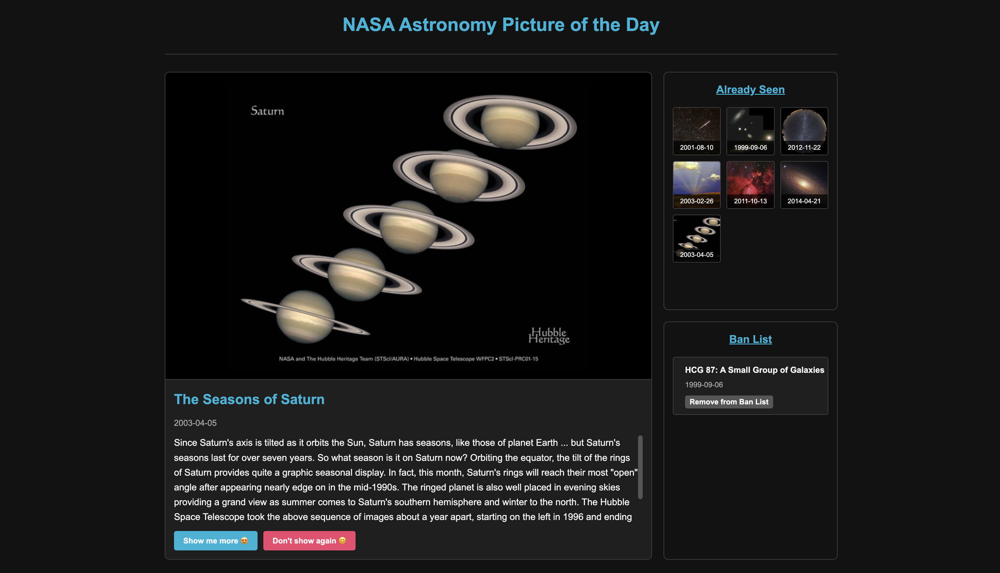

# NASA APOD Explorer 🛸



A React-based web application that lets you explore NASA's Astronomy Picture of the Day archive. Discover stunning astronomical images, manage your viewing history, and curate your experience by filtering out content you don't want to see again.

## Features ✨

- **Explore the Cosmos**: View today's Astronomy Picture of the Day directly from NASA's API
- **Discovery Mode**: Randomly explore NASA's extensive archive dating back to 1995
- **Viewing History**: Keep track of images you've already seen
- **Content Filtering**: Ban images you don't want to see again
- **Responsive Design**: Works beautifully on desktop and mobile devices

## Live Demo 🌐

[Check out the live demo ](https://nasa-apoc-hb.vercel.app/)

## Tech Stack 👩🏽‍💻

- React.js
- NASA APOD API
- CSS3
- JavaScript

## Project Structure 🗂️

```
src/
├── components/
│   ├── NasaImageViewer.jsx  # Main image display component
│   ├── AlreadySeenList.jsx  # Component for viewing history
│   └── BannedList.jsx       # Component for banned content
├── App.jsx                  # Main application component
├── App.css                  # Styles for the application
└── index.js                 # Entry point
```

## Future Enhancements 💡

- [ ] Add local storage to persist data between sessions
- [ ] Implement a favorites collection feature
- [ ] Add search functionality by date or keyword
- [ ] Create a calendar view to pick specific dates
- [ ] Add sharing functionality for social media
- [ ] Implement a dark/light theme toggle

## Challenges and Learnings 📚

Building this project helped me learn about:

- Working with external APIs and handling API responses
- State management in React
- Component-based architecture in frontend applications
- Creating a responsive UI without external libraries
- Error handling and user experience design

## Personal Goal 🎯

This project was developed as part of my Web 102 course with [CodePath](https://www.codepath.org/) to enhance my React skills while blending my passion for astronomy with web development. The NASA APOD API offers a fantastic opportunity to practice real-world API integration while exploring the wonders of space.

## Contributing 🤝🏾

While this is a personal project, suggestions and feedback are welcome! Feel free to open an issue or submit a pull request if you have ideas for improvements.

## License ⚖️

This project is licensed under the MIT License - see the [LICENSE](LICENSE) file for details.

---

Created with 🛸👩🏾‍🚀🪐✨🔭🚀🌌 by [Houlaymatou B.](https://github.com/code-techhb)
